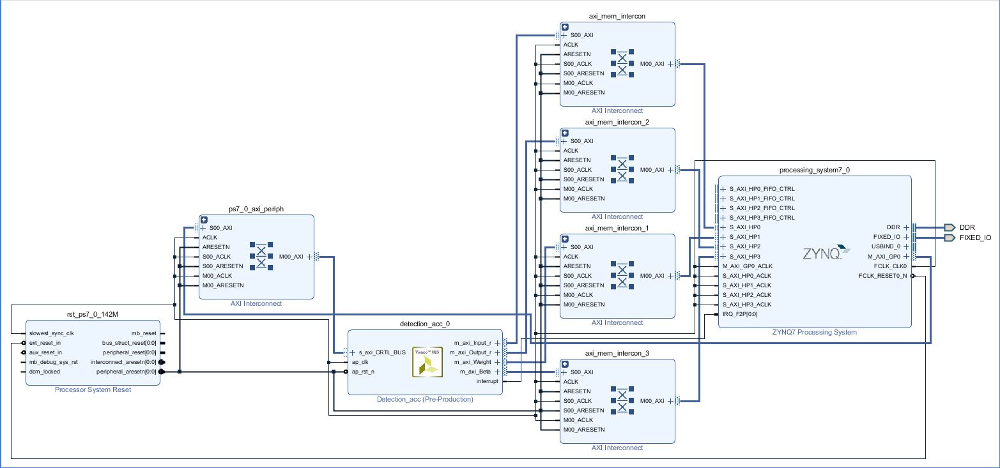

# Block Design
Here is a way to help you complete the Block Design in Vivado.

### 1. Create Vivado Project

First, you have to open the Vivado, create a new project, and select the PYNQ-Z2 board.

### 2. Import the HLS IP

You need to add the HLS IP folder to the current IP repository, and then you can see an IP called `Detection_acc` in IP Catalog.

### 3. Create Block Design

Just create a Block Design, and complete it as below:

Then you can click `Validate Design` to check if your design is correct.

If your design is correct, you can click `Export Block Design` to get the **tcl** file.

### 4. Generate Bitstream

Just click `Generate Bitstream`, and wait a moment,  you will get the **bit** and **hwh** file.