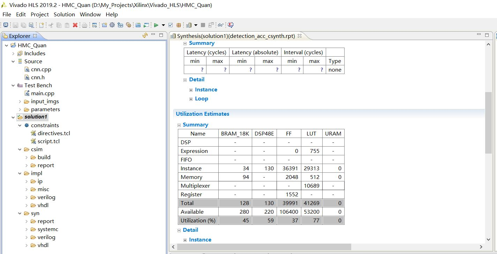

# Generate HLS IP
Here is a way to help you generate IP in Vivado HLS.

### 1. Create HLS Project

First, you have to open the Vivado HLS, create a new project, and select the PYNQ-Z2 board.

### 2. Add the Source Code

The **cnn.cpp** and **cnn.h** are the source files, the **main.cpp**、`input_images/` and `parameters/` are testbench files.

### 3. C Synthesis

Select the `detection_acc()` as the top function and run `C Synthesis` to get the RTL code.

The Synthesis result is below:

### 4. Export RTL

Then, you should run `Export RTL` to package this RTL code to IP.

**Note:** The parameters here are **int8** & **int32**. And due to the time constraints, we did not make further optimization in this version, we may optimize this project in the future.