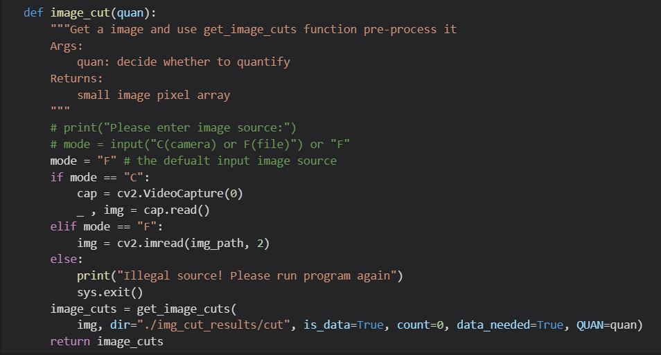

# Run on PYNQ
Here is a way to help you run this project on PYNQ-Z2.

### 1. Preparations for PYNQ

First, you need to burn the v2.5 image of PYNQ-Z2 to the SD card. Then use the ethernet cable to connect PYNQ to the router (recommend) or your computer and use the Micro-USB cable to connect PYNQ to your computer.

### 2. Add the files

You need to download all these files and upload them to the `jupyter_notebooks/Handwritten_Mathematical_Calculator_on_FPGA/` folder of PYNQ. Don't forget to add the two files generated in Vivado to the `hw_bd/` folder (or you can just use these precompiled files which I provided).

### 3. Run from picture in SD card

Just run the **HMC.ipynb** file, you will get the same result as the demo I provided before.

### 4. Run from Webcam (Optional)

If you want to use webcam as the input, you should modify `mdoe = "F"` to `mode = "C"` in the `image_cut()` function~~, and rename **cv2_im** to **img** ,then you should comment the fourth sentence.~~

Finally, just connect your webcam to PYNQ and run this code.