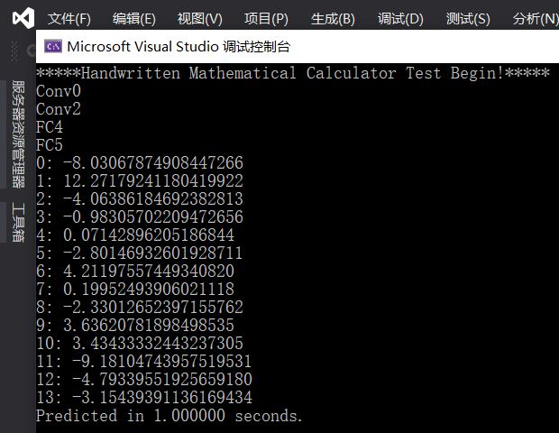

# Software_Version
This is C version of the tensorflow model in `Software_Project/` folder.

These files can be run in **Microsoft Visual Studio 2019**. Just create a new project and add this files to your project.

The result is below:

**Note:** This code **cannot** be synthesized in Vivado HLS, and the parameters here are all **float32**.