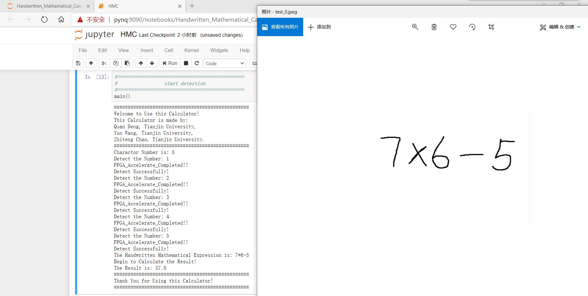
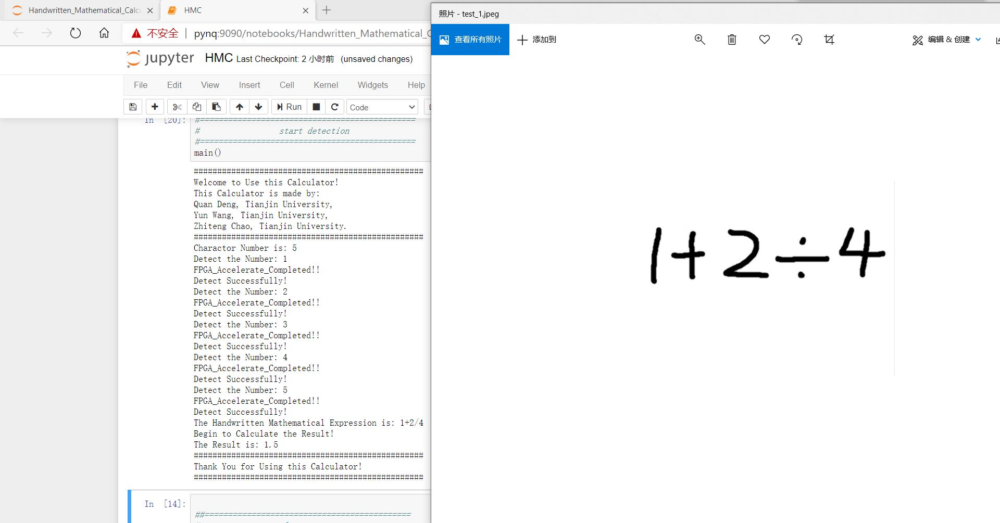
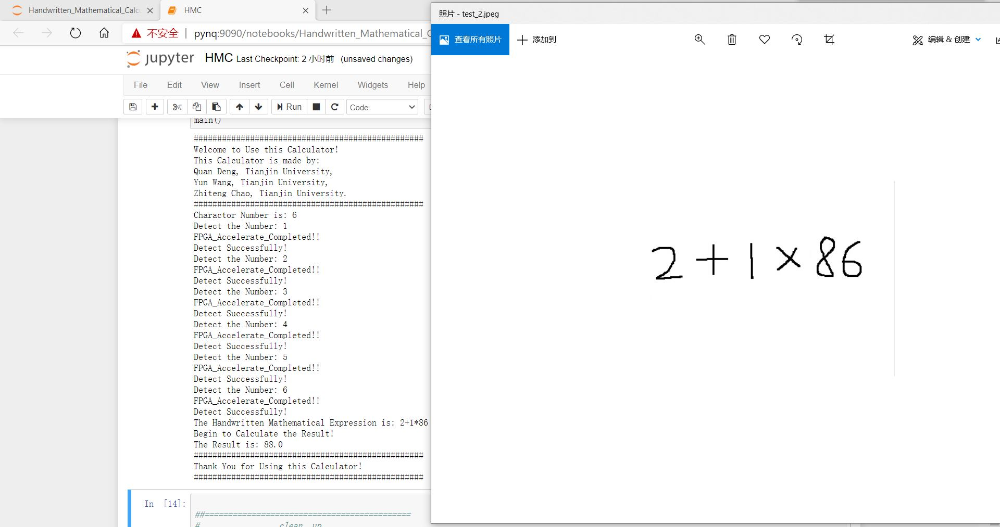

# Handwritten_Mathematical_Calculator_on_FPGA
In this project, we mainly implemented a **Handwritten Mathematical Calculator** on the **PYNQ-Z2** FPGA platform. It uses the picture stored in the SD card or the USB camera as input. Then it will detects possible numbers or mathematical operators in the picture, extracts these elements separately, and resizes it to $(32\times32\times1)$. The convolutional neural network will finally output an array of size $(14\times1)$. The meanings of these 14 numbers is shown in Table 1:

| Number | Meaning  |
| :----: | :------: |
|   0    |    0     |
|   1    |    1     |
|   2    |    2     |
|   3    |    3     |
|   4    |    4     |
|   5    |    5     |
|   6    |    6     |
|   7    |    7     |
|   8    |    8     |
|   9    |    9     |
|   10   |    +     |
|   11   |    -     |
|   12   | $\times$ |
|   13   |  $\div$  |

Subsequently, we will accept the recognition result of the convolutional neural network, and finally calculate the result of the input.

This project is built for 2020 SEU-Xilinx International Summer School.

## Quick Instructions

Here is a way to help you quickly implement our project on your own FPGA platform.

### 0. Prerequisites

- Microsoft Visual Studio 2019 (or other C++ compiler)
- Vivado HLS 2019.2、Vivado 2019.2 and Vitis 2019.2 (Optional)
- PYNQ-Z2 FPGA Platform
- PYNQ-Z2 v2.5 images
- Ethernet cable and Micro-USB cable (Optional)
- A Webcam like Logi C270 (Optional)

This project is implemented by using **Vivado HLS 2019.2** and **Vivado 2019.2** tools, but it should be possible to be rebuilt on higher versions.

### 1. Generate HLS IP

All **HLS-related** files are placed under the `Hardware_Project/HLS_Version/` folder.

Please refer to the file `Hardware_Project/HLS_Version/README.md` for specific operation steps.

### 2. Block Design in Vivado

After performing the operations in HLS and export the IP successfully, you need to create a hardware project in Vivado and create a **Block Design**. For specific steps, please refer to the file `Hardware_Project/Block_Design/README.md`.

### 3. Run on PYNQ-Z2

The files needed to run this project on PYNQ-Z2 are placed in the `Hardware_Project/Pynq/` folder.

After completing Block Design in Vivado and successfully generating **bit**、**hwh**、and **tcl** files, rename them to **hmc.xxx** and put them in the `hw_bd/` folder. Finally, just run the **HMC.ipynb** file and enjoy your calculator.

## Demo

Here are some test results:

## 

## Finally

If you have any good suggestions or find any problems of this project, please feel free to contact me.